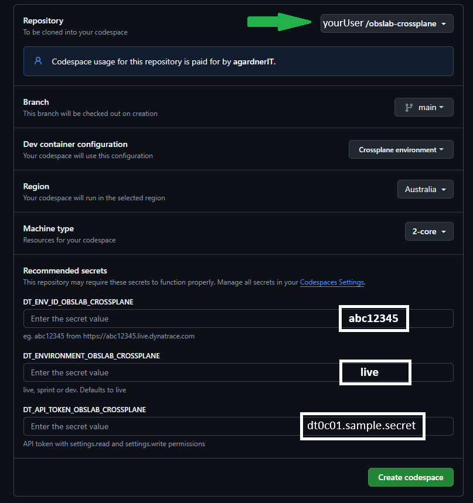

# Getting Started

## Dynatrace Environment

You must have access to a Dynatrace SaaS environment. [Sign up here](https://dt-url.net/trial){target="_blank"}

Save the Dynatrace environment ID and environment

* The ID is the first portion of the URL. (eg. `acb12345` from `https://abc12345.live.dynatrace.com`)
* Your environment is probably `live` but could also be `sprint` or `dev`

## Create API Token

!!! info "API Token Permissions"
    In this demo, you will only create an auto-tag rule,
    therefore the only permissions you require are `settings.read` and `settings.write`

    However, if you want to create additional configuration, your API tokens will differ and you may need an OAuth client.

    If you choose to extend this tutorial,
    refer to the [Terraform documentation](https://registry.terraform.io/providers/dynatrace-oss/dynatrace/latest/docs#example){target=_blank} to understand exactly which permissions you require.

In Dynatrace:

* Press `ctrl + k`. Search for `access tokens`.
* Create a new access token with the following permissions:
    * `settings.read`
    * `settings.write`

!!! info "Token used by Crossplane"
    Crossplane will use this API token to push and pull data
    from your Dynatrace environment.

## Start Demo

Click this button to open the demo environment. This will open in a new tab.

{target="_blank"}

!!! info "Use your repository"
    In the repository dropdown
    be sure to use `yourUsername/obslab-crossplane`

!!! tip "Price"
    GitHub includes a generous free tier.
    If you follow the [cleanup](cleanup.md){target=_blank} instructions to delete your codespace once done, you will not be charged.

* Select your repository from the repository dropdown box.
* Fill in the form with the details you've already gathered.
* Click `Create codespace`
* Proceed to the next documentation step with the link below.

- [Click Here to Continue :octicons-arrow-right-24:](installation-explained.md)

